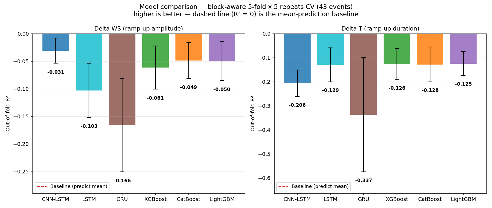
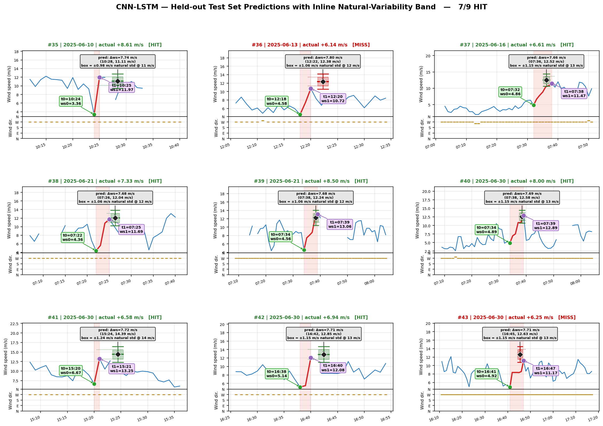
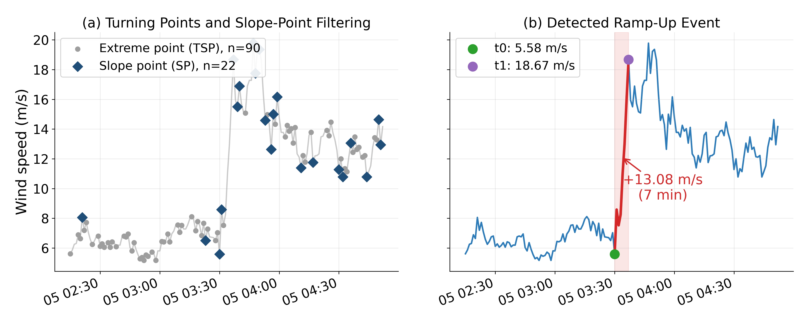
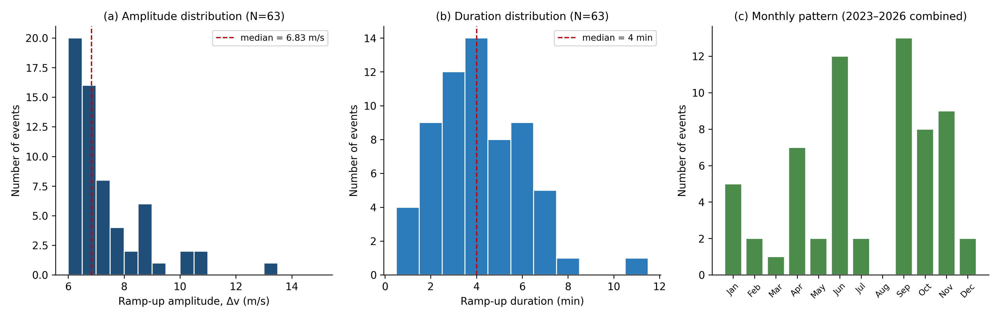
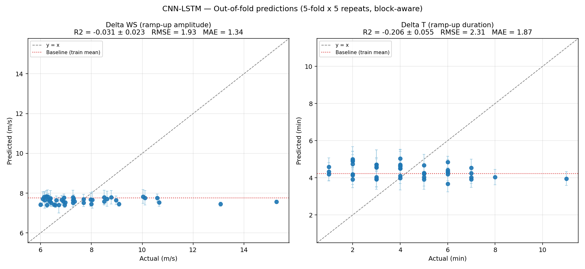
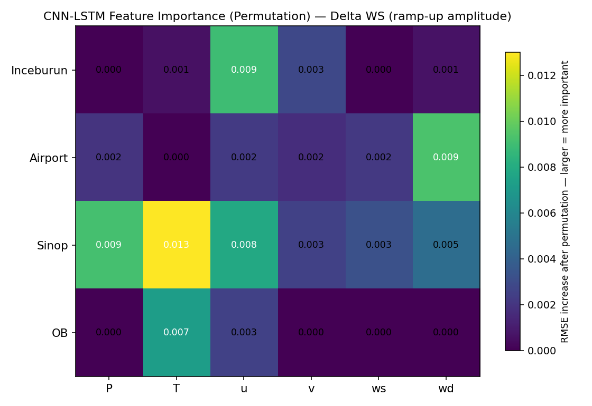
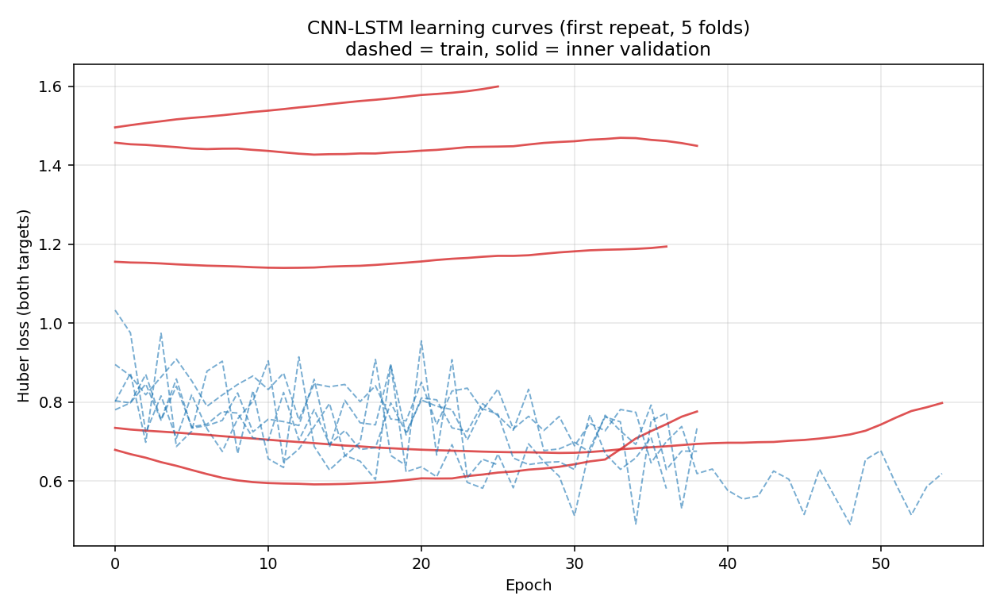

# Detecting & Predicting Wind Speed Ramp-Up in Sinop

A wind-energy data science project: detecting sudden wind speed ramp-up events from real station data, then testing whether they can be predicted 24 hours ahead using six different machine learning models.

Status: the accompanying paper is being prepared for submission to a peer-reviewed journal. The full manuscript is not included here yet, pending the journal's policy on prior public disclosure — this README summarizes the method and results.

## Why this matters

A ramp-up event — a large, sudden increase in wind speed over a short window — is one of the hardest things to plan around in wind energy operations and grid security. It also tends to happen without much warning, which is exactly why it's called an "event" rather than a trend. This project asks two separate questions: can these events be reliably *detected* in noisy real-world sensor data, and once detected, can their size and duration be *predicted* in advance from the 24 hours of weather data preceding them?

## Pipeline

```
raw station data (4 stations, minute resolution)
        │
        ▼
quality control  ──▶  4 literature-based tests flag ~12% of points as unreliable
        │  (ramp detection runs on the RAW series, not the cleaned one — see below)
        ▼
ramp-up detection  ──▶  63 events found, adapted from a wind-power ramp detection method
        │
        ▼
feature matrix  ──▶  24h × 4 stations × 6 variables per event (43 events usable)
        │
        ▼
6 models compared  ──▶  3 tree-based + 3 neural-network based, block-aware CV
        │
        ▼
evaluation  ──▶  R² / RMSE / MAE, plus a natural-variability HIT/MISS check
```

### 1. Quality control (`src/quality_control/`)

Four tests, each based on an existing standard rather than an invented threshold: a physical-range check, a constant-value/frozen-sensor check, a sudden-jump ("spike") check, and a statistical outlier check using the **modified Z-score** (median + MAD instead of mean + std, so the outliers being detected don't get to inflate the yardstick used to detect them — Iglewicz & Hoaglin, 1993). Together these flagged 12.08% of the data as unreliable; the largest single contributor was the frozen-sensor test (11.62%), from a period of prolonged hardware dropout at one station.

### 2. Ramp-up detection (`src/ramp_detection/`)

Adapted from a method originally built for wind **power** ramp detection (Kuang et al., 2020) to work on wind **speed** instead. The spike-handling logic borrows the Swinging Door Algorithm from Florita et al. (2013): a point is judged not by its raw difference from its neighbor, but by how far it deviates from the line connecting the points on either side of it.

A deliberate design choice: detection runs on the **raw, uncleaned** series, before the quality-control step. A point altered or removed during cleaning could be exactly the start or end of a real event — cleaning first would risk deleting the very thing being measured. 63 events were detected in total; 43 were usable for modeling once restricted to the date range where all four stations overlap.

### 3. Feature matrix (`src/feature_matrix/`)

For each event, the 24 hours immediately preceding it are turned into a 24 (hours) × 4 (stations) × 6 (variables: pressure, temperature, wind u/v components, wind speed, wind direction) input matrix. The two prediction targets are the event's amplitude (Δws) and duration (Δt).

### 4. Models (`src/models/`)

Six models, three tree-based (XGBoost, CatBoost, LightGBM) and three neural-network based (CNN-LSTM, LSTM, GRU), evaluated under an identical block-aware 5-fold × 5-repeat cross-validation scheme so the comparison is apples-to-apples.

### 5. Evaluation

Beyond standard R²/RMSE/MAE, a second, complementary check: for each test-set prediction, is the actual outcome within the wind's own natural minute-to-minute variability at that speed level? Natural variability isn't constant — it grows with wind speed (r = 0.97 between speed and local std) — so the acceptance band scales with the predicted speed rather than being a single fixed number. This is scored as HIT/MISS on the held-out test events.

## Results

None of the six models beat a simple constant-mean baseline on R² — every model's R² came out negative on both targets. Reported honestly rather than hidden, because that's the actual finding:

| Target | Best R² | Model |
|---|---|---|
| Δ amplitude (delta_ws) | -0.031 | CNN-LSTM |
| Δ duration (delta_t) | -0.125 | LightGBM |

Full comparison: [`results/model_comparison/comparison_table.csv`](results/model_comparison/comparison_table.csv)



This isn't a contradiction with the HIT/MISS numbers below — R² measures whether a model distinguishes a *big* event from a *small* one, which none of these models manage to do from 24h-ahead weather data alone. HIT/MISS asks a different, complementary question: does the prediction land within the range that speed level's own natural variability would produce anyway?

| Model | HIT / 9 test events |
|---|---|
| **CNN-LSTM** | **7/9** |
| LightGBM | 6/9 |
| CatBoost | 6/9 |
| GRU | 5/9 |
| XGBoost | 5/9 |
| LSTM | 3/9 |



CNN-LSTM is the model examined in most depth in the paper — not because it "won" outright (the R² gap to the other models is small and the sample is only 9 test events), but because it is the most consistent across both metrics.

<details>
<summary>More figures</summary>

Detected ramp-up event, example (5 Nov 2023):


Ramp-up event statistics (63 detected events — amplitude, duration, monthly pattern):


CNN-LSTM out-of-fold predictions:


CNN-LSTM permutation feature importance:


CNN-LSTM training/validation loss:


</details>

## Beyond the paper: the full results gallery

The paper only has room for one featured model and a handful of figures. This repo has more, because the code produces more than what made it into the manuscript:

- [`results/all_models/`](results/all_models/) — the same three diagnostic plots (OOF scatter, feature importance, HIT/MISS) for **all six models**, not just CNN-LSTM
- [`results/data_exploration/`](results/data_exploration/) — cross-station checks done before modeling: wind direction agreement between the 4 stations, per-station Weibull wind speed distributions, and wind vector (u/v) distributions
- [`results/data_coverage_maps/`](results/data_coverage_maps/) — calendar maps (2014–2025) showing exactly when each station's data is present vs. missing, per variable — the concrete evidence behind the quality-control numbers
- [`results/monthly_time_series/`](results/monthly_time_series/) — 48 months of the cleaned, minute-resolution wind speed series, one plot per month

## Data

Raw station data is **not** included in this repo — three of the four stations are official government (Turkish State Meteorological Service, MGM) stations, and that data isn't mine to redistribute. See [`data/README.md`](data/README.md) for the expected schema if you want to run this on your own station data. What's here is the full, real methodology: how the data was cleaned, how events were found, and how the models were built and compared — not the dataset itself.

## Repository structure

```
src/
  quality_control/    4 QC tests -> cleaned minute-resolution series
  ramp_detection/      event detection on the raw series
  feature_matrix/       24h x 4-station x 6-variable input matrix per event
  std_analysis/          natural-variability reference table (for HIT/MISS)
  models/
    _ortak/               shared evaluation/plotting code used by every model
    cnn_lstm/, lstm/, gru/, xgboost/, catboost/, lightgbm/
    comparison/           cross-model comparison and figures
  config.py               PROJECT_ROOT / DATA_DIR / RESULTS_DIR
results/
  ramp_detection/           detection example + event statistics
  model_comparison/          R2/RMSE/MAE bar charts + comparison table
  all_models/                 OOF scatter / feature importance / HIT-MISS, all 6 models
  data_exploration/            cross-station correlation, Weibull fits, UV distributions
  data_coverage_maps/           per-station, per-variable data availability (2014-2025)
  monthly_time_series/          48 months of cleaned minute-resolution wind speed
data/                     not included - see data/README.md
```

## Tech stack

Python · pandas / numpy · PyTorch (CNN-LSTM, LSTM, GRU) · XGBoost · CatBoost · LightGBM · scikit-learn · matplotlib

## Running it

```bash
pip install -r requirements.txt
```

Place your own station data under `data/` matching the schema in [`data/README.md`](data/README.md), then run the pipeline stages in order (quality control → ramp detection → feature matrix → std analysis → a model of your choice in `src/models/`). Each script is a standalone entry point.

## License

MIT — see [LICENSE](LICENSE). The dataset itself is not included; see [`data/README.md`](data/README.md).

## Author

Atakan Türkoğlu
