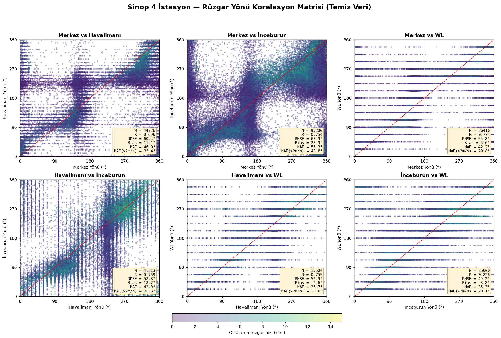
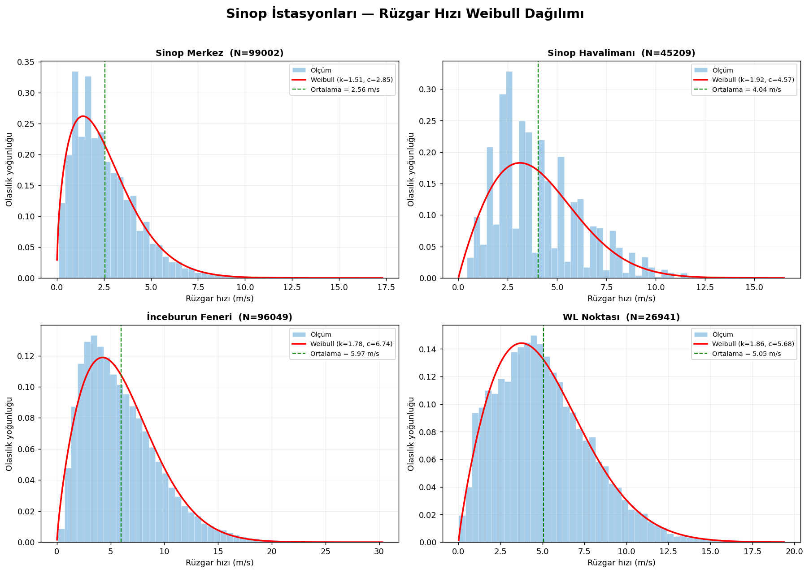
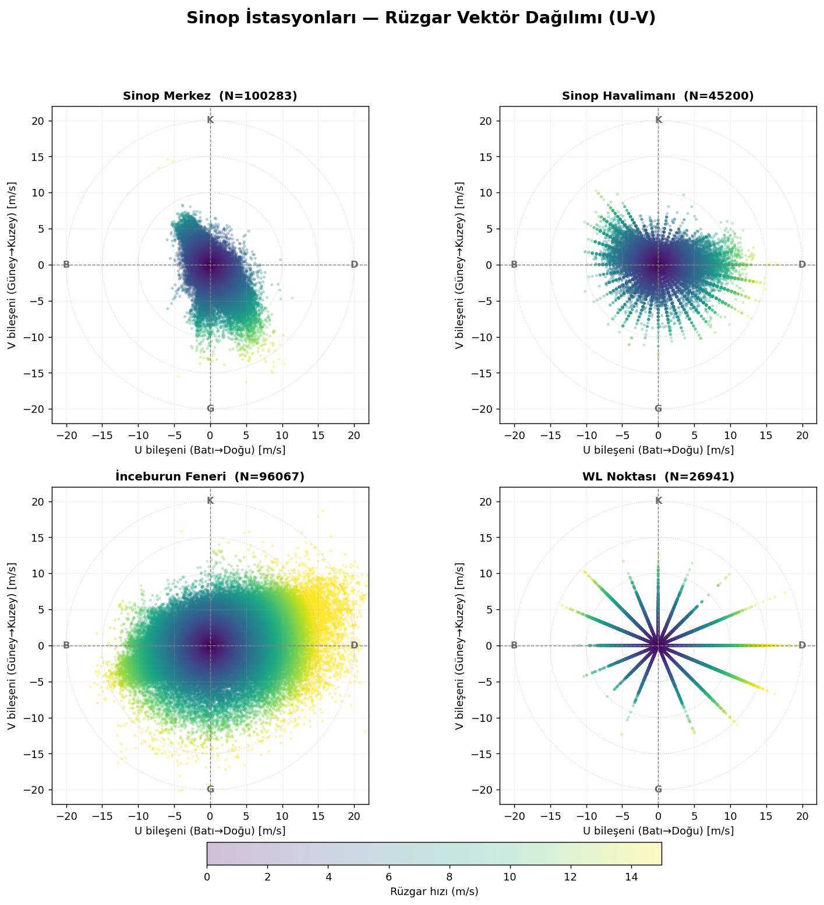

# Data exploration

Cross-station checks done before any modeling — not part of the paper itself, but part of understanding whether the four stations' data can be trusted and combined. All plots are built directly from the cleaned station series.

## Wind direction agreement between stations

Pairwise comparison of wind direction (°) between all 4 station pairs, colored by wind speed. Two things stand out: agreement is far from perfect (R between 0.70–0.83 across pairs — station-to-station direction readings diverge more than a single "true" regional wind would suggest, likely due to local topography around each station), and agreement consistently improves at higher wind speeds (the MAE restricted to >2 m/s is lower than the overall MAE in every single pair). This matters for the main pipeline: it's part of why the ramp-up feature matrix uses each station's own readings rather than assuming they're interchangeable.

## Wind speed distribution per station

A Weibull fit per station, the standard way wind speed distributions are characterized in wind-resource assessment. Mean wind speed differs substantially by site — Sinop Merkez is the calmest (2.56 m/s mean), İnceburun Feneri the windiest (5.97 m/s) — consistent with İnceburun being an exposed coastal/headland location and Merkez being more sheltered.

## Wind vector distribution (u/v components)

Each point is one measurement's wind velocity vector (u = west→east, v = south→north), colored by speed. Sinop Merkez and İnceburun each show a clear directional bias (skewed south and east-dominant respectively) rather than an even spread in all directions. The OB station's panel shows a distinct "starburst" pattern of discrete rays rather than a continuous cloud — a sign that this particular sensor reports wind direction in discrete steps rather than continuously; this is exactly the kind of instrument-specific quirk the quality-control step (`src/quality_control/`) has to account for.
